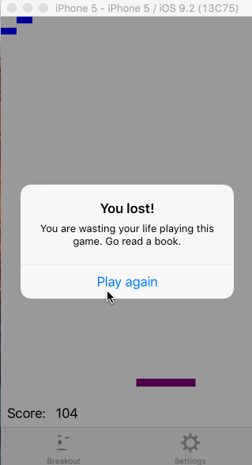

# Breakout
You get rid of a bunch of blue squares.  Supposedly, this assignment requires us to be part of the App Developer program so we can hook it up to the phone and test out the accelerometer/real game play.  I may do that.  I may not.

## Rules
1. If the ball flies through the bottom of the screen, you lose.
2. If you turn on the red blocks, hitting the red blocks will shrink your paddle.
3. Difficulty increases your ability to acquire high scores, but also makes the ball really fast.
4. Drunk mode just makes your ball randomly hit things.  DUI on hardest difficulty makes the game basically unplayable as it could just change direction in the last second to fly to the bottom of the screen.
5. Tap the screen to have the ball go in a random direction, but this will lower your score some.

## Required Tasks
- [x] Create a straightforward Breakout game using Dynamic Animator. See the image in the Screen Shots section below to get a general idea of the game, but your UI should not look exactly like the Screen Shot. Creativity is encouraged and will be rewarded.
- [x] When a brick is hit, some animation of the brick must occur. For example, the brick might flip over before fading out or it might flash another color before disappearing, etc. Show us that you know how to animate changes to a UIView.
- [x] In addition to supporting a pan gesture to move the game’s paddle, you must support a tap gesture which pushes the bouncing ball in a random direction an appropriate (i.e. noticeable, but not game-destroying!) amount.
- [x] When all the bricks have been eliminated (or the game is otherwise over), put up an alert and then reset the bricks for the next game.
- [x] Your game should be designed to support at least 4 different variables that control the way your game is played (e.g. number of bricks, ball bounciness, number of bouncing balls, a gravitational pull, special bricks that cause interesting behavior, etc.).
- [x] Use a tab bar controller to add a second tab to your UI which contains a static table view with controls that let the user set these 4+ different variables to meaningful game-play values. Your game should start using them immediately (i.e. as soon as you click back on the main game play tab).
- [x] This game-play settings MVC must use at least one of each of the following 3 iOS classes: UISwitch, UISegmentedControl and UIStepper (you may substitute UISlider for the UIStepper if that’s more appropriate to your setting).
- [x] Your game-play configurations must persist between application launchings.
- [x] Your application should work on both iPhone and iPad. It is up to you to decide what
differences exist between the two platforms (if any). 

## Extra Credit
- [x] Use sophisticated Dynamic Animation. For example, you might find a creative way to use the action method in a behavior or use something like linear velocity in your calculations.
- [x] As mentioned above, creativity will be rewarded, especially interesting game-play settings.
- [x] Keep score in your game. Give points for whatever you think makes sense, but hopefully playing “more skillfully” results in a higher score.
- [x] Do some cool artistic design in your user-interface (either by drawing or using images).
- [x] Pausing your game when you navigate away from it (to go to settings) is a bit of a challenge (because you basically have to freeze the ball where it is, but when you come back, you have to get the ball going with the same linear velocity it had). Give it a try. It’s all about controlling the linear velocity of the ball.
- [ ] Integrate the accelerometer into your application somehow (maybe real-life gravity affects the flight of the bouncing ball?). Check out the documentation for the CoreMotion framework. We will be covering CoreMotion later in the quarter, but this could still be a good exercise for practice learning something without benefit of a lecture explanation (good practice for your final project and maybe you even want to use CoreMotion in your final project and can’t wait for it to get covered in lecture). Plus it’s just kind of a cool feature in this app.

## Demos
###Changing number of rows
First demo shows that I can change the number of rows.  

### Settings
Second demo shows that the game is paused when I change settings.  It also shows that the red blocks/difficulty/drunk mode settings take into effect immediately when resuming the game.  

### Winning
Third demo shows the winning screen.  

### Works on Ipad too...kinda
UILabel for score in retrospect should have been based on view's height instead.  Likewise for the table view settings as well as the tab bar at the bottom.  But I'm sure if you have a large iPad this is workable.

## Other Thoughts
  * Pausing extra credit is pretty much necessary.  Switching to the other tab makes it so that the `animateWithOptions` never completes.
  * Animations are tricky.  If you switch views while in the middle of animating, animation will never complete.  I fixed it with the following solution (but I'm sure could be cleaner):
    * I only animate during block collision -- so every time there is a block collision, I append the view to a buffer.  When the `viewDidAppear`, I run through this buffer, clean up the animations and remove all the views from its superview.  Then, I dump the buffer.  Now, when you have this limbo-animation from going to settings and then coming back, you will clean the UIViews each time you come back.  Not very elegant, but it works.
  * Restart is required when changing number of rows because unless you restart the game, there's no good way to handle this.  And restarting the game mid-game is pretty ugly.
  * When the ball goes very fast, the handling gets very hairy.  If the paddle is not floating but touching the bottom border, then we run into a question: when to disable the collision for the ball and let it fly through?  If you disable it once you've touched the border, you are SOL because the ball reacts to the boundary already.  If you create a small buffer area above the bottom boundary, you will end the game too early due to false positives.  If you create a small buffer area below the bottom boundary, you will still end the game too early because the ball will temporarily fly through the bottom before "colliding" with the bottom boundary.
    * The solution was just to make the paddle float and have a larger vertical space to end the game with.  Now, even if the ball is very fast, there is a lot more time in the code to handle game-stopping behavior gracefully.
  * Games are hard to make.  Tons of bugs.
  * If multiple timers are present, they seem to interfere with each other.
  * When the ball is flying too fast, it'll sometimes merge with the paddle.  Probably there is a good way to handle this, like if the rects intersect, you preserve the momentum of the ball, but now teleport the ball just above the paddle so it bounces off the paddle correctly.  But then again, there is no guarantee this method will prevent the ball from re-merging with the paddle...
